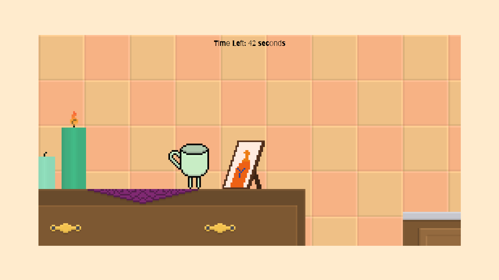
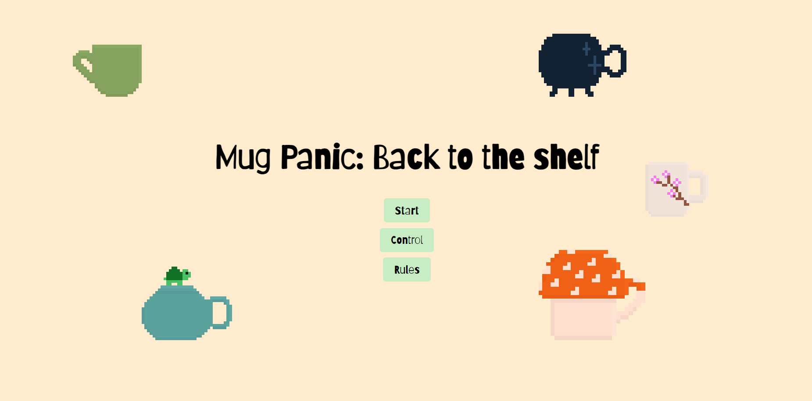

# 🎮 **Mug Panic: Back to the shelf** 

> **The game**: It is about a cup that needs to get back to the shelf as fast as possible without falling down or running out of time.
> 

---

## 🌐 **Play the Game**
[Click here to play the game!](https://your-github-username.github.io/repository-name)

---

## 📸 **Screenshots**

### Main Gameplay:

  
  
*You walk around the kitchen trying not to break.*

---

### Menu and UI:

  
  
*At the start screen, you can see how to control, the game and read the rules*

---

## 🎨 **Spritesheets**
Below are the sprites used to create characters and objects in the game:

### Player Character:

  
  
*Figure 3: Player character animations.*

---

### The Obstacles:

  
  
*Flame from a candle*

  
  
*Flame from a candle*

---

## ✍️ **Reflection**

### What went well:
- **Creative Design:** The theme and style came together seamlessly, and the sprites were fun to design.
- **Core Mechanics:** The gravity-based gameplay worked better than expected and provided a unique challenge.

### Challenges:
- **Time Constraints:** Implementing all the features we envisioned wasn’t possible due to the limited timeframe.
- **Bug Fixes:** Handling collisions and edge cases for gravity mechanics was tricky.

### Lessons Learned:
- **Prototyping Matters:** Testing early prototypes helped refine the core mechanics quickly.
- **Keep it Simple:** Focusing on one unique mechanic instead of multiple features made the game more polished.
